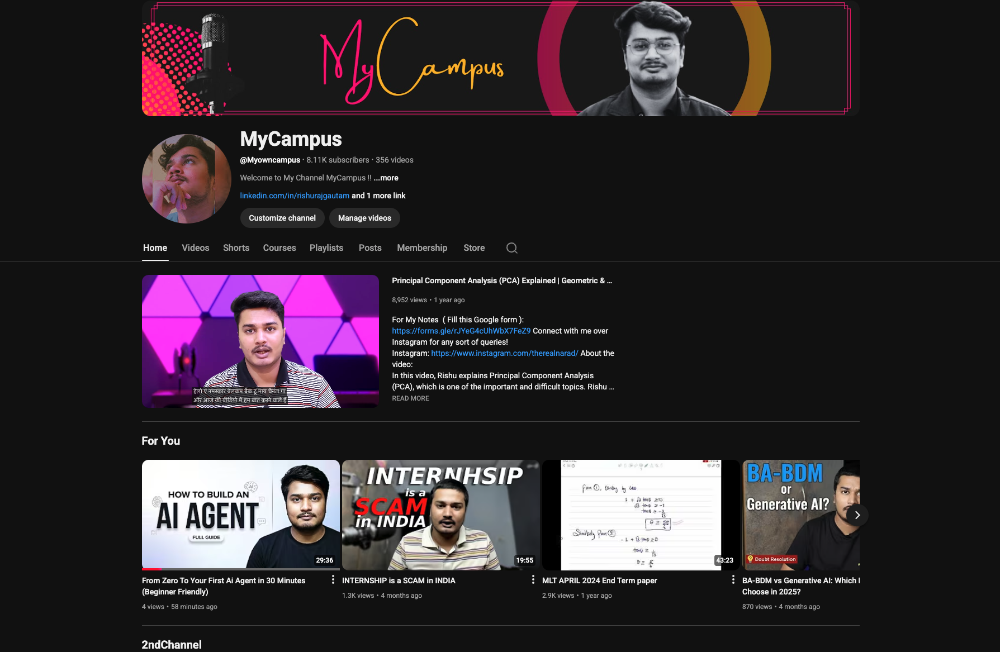

# 🎓 MyCampus Hub

A collection of AI/ML projects built for educational purposes. Each project is taught in YouTube videos and other tutorials, making it easy for everyone to access, learn, and build upon.

## 📖 About

This repository serves as a **learning hub** containing multiple hands-on projects, each in its own folder. The projects are designed to help you understand various AI/ML concepts through practical implementation.

**🎯 Purpose:**
- Learn by building real projects
- Access code from video tutorials
- Build on top of existing implementations
- Contribute your own improvements

## 🚀 Projects

| Project | Description | Status |
|---------|-------------|--------|
| [AI Agent from Scratch](./ai-agent-from-scratch/) | Build a ReAct AI agent with tool calling using AutoGen | ✅ Ready |
| [AutoGen Code Agent](./autogen-code-agent/) | Code execution agent that writes and runs Python code | ✅ Ready |

> 📢 **More projects coming soon!** This repo gets frequent updates with new projects.

## Video Tutorials
> Find all video tutorials of this project on the youtube channel

[](www.youtube.com/@myowncampus)


## 🛠️ Prerequisites

- Python 3.14+
- [uv](https://docs.astral.sh/uv/) - Fast Python package installer
- [Ollama](https://ollama.com/) - Local LLM runtime (or any OpenAI-compatible API)

## ⚡ Quick Start

### 1. Clone the Repository

```bash
git clone https://github.com/yourusername/mycampus-hub.git
cd mycampus-hub
```

### 2. Install uv (if not already installed)

```bash
# macOS/Linux
curl -LsSf https://astral.sh/uv/install.sh | sh

# Windows
powershell -ExecutionPolicy ByPass -c "irm https://astral.sh/uv/install.ps1 | iex"
```

### 3. Create Virtual Environment & Install Dependencies

```bash
uv venv
source .venv/bin/activate  # On Windows: .venv\Scripts\activate
uv sync
```

### 4. Setup Environment Variables

Create a `.env` file in the root directory:

```env
OLLAMA_MODEL=qwen2.5:7b
OLLAMA_BASE_URL=http://localhost:11434/v1
```

### 5. Navigate to a Project and Run

```bash
cd ai-agent-from-scratch
python app.py
```

## 📦 Dependencies

All projects share common dependencies managed via `pyproject.toml`:

- `autogen` - Multi-agent conversation framework
- `pyautogen` - AutoGen Python package
- `python-dotenv` - Environment variable management
- `pyyaml` - YAML configuration parsing

## 🤝 Contributing

Contributions are welcome! Feel free to:

- 🐛 Report bugs
- 💡 Suggest new projects
- 🔧 Submit pull requests
- ⭐ Star this repo if you find it helpful!

## 📺 Video Tutorials

Each project folder contains a README with links to the corresponding video tutorial.

## 📄 License

This project is open source and available for educational purposes.

---

**Happy Learning! 🚀**
