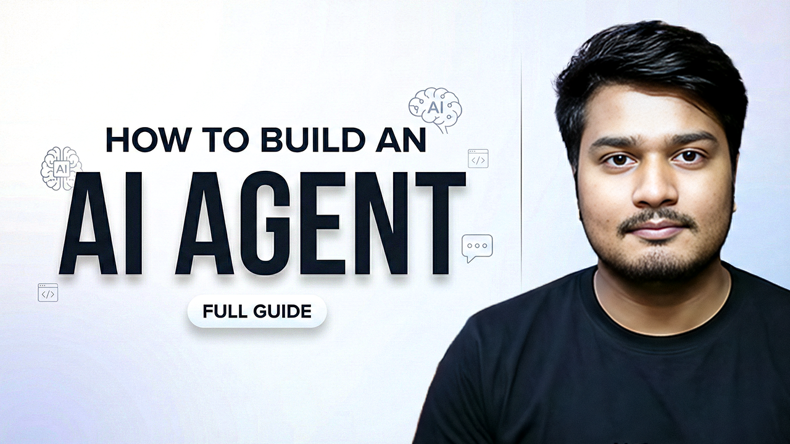

# 🤖 AI Agent from Scratch (ReAct Pattern)

Build a ReAct (Reasoning + Acting) AI agent with tool calling using AutoGen and Ollama.

## 📖 Overview

This project demonstrates how to build an AI agent that follows the **ReAct pattern**:
1. **PLAN** - Think about what needs to be done
2. **ACT** - Call the appropriate tool with correct arguments
3. **OBSERVE** - Wait for and analyze the result
4. **RESPONSE** - Provide the final answer

The agent uses a calculator tool to perform mathematical operations, showcasing how LLMs can interact with external tools.

## 🏗️ Architecture

```
┌─────────────────────┐     ┌─────────────────────┐
│   Assistant Agent   │◄───►│   User Proxy Agent  │
│   (Reasoning/LLM)   │     │   (Tool Executor)   │
└─────────────────────┘     └─────────────────────┘
                                      │
                                      ▼
                            ┌─────────────────────┐
                            │   Calculator Tool   │
                            │ (add/sub/mul/div)   │
                            └─────────────────────┘
```

## 🛠️ Prerequisites

- Python 3.14+
- [uv](https://docs.astral.sh/uv/) installed
- [Ollama](https://ollama.com/) running locally (or any OpenAI-compatible API)


## 📺 Video Tutorial

Watch the full tutorial to understand the concepts in depth!

[](https://youtu.be/hz2lEDe2LmM)

## 🚀 How to Run

### 1. Navigate to Project Directory

```bash
cd ai-agent-from-scratch
```

### 2. Install Dependencies (from root directory)

If you haven't already installed dependencies:

```bash
# From root directory
uv venv
source .venv/bin/activate
uv sync
```

### 3. Setup Environment Variables

Create a `.env` file in the project directory (or root):

```env
OLLAMA_MODEL=qwen2.5:7b
OLLAMA_BASE_URL=http://localhost:11434/v1
```

### 4. Start Ollama (if using locally)

```bash
ollama serve
# In another terminal, pull a model:
ollama pull qwen2.5:7b
```

### 5. Run the Agent

```bash
python app.py
```

## 📁 Project Structure

```
ai-agent-from-scratch/
├── app.py          # Main application with agent logic
├── config.yaml     # LLM configuration
└── README.md       # This file
```

## ⚙️ Configuration

The `config.yaml` file contains LLM settings:

```yaml
config_list:
  - model: "${OLLAMA_MODEL}"
    base_url: "${OLLAMA_BASE_URL}"
    api_key: "ollama"
    price: [0, 0]
    temperature: 0.1
    cache_seed: null
```

## 🔧 Customization

### Add Your Own Tools

You can extend the agent by adding more tools:

```python
def my_custom_tool(
    param1: Annotated[str, "Description of param1"],
    param2: Annotated[int, "Description of param2"]
) -> str:
    # Your tool logic here
    return result

# Register the tool
autogen.register_function(
    my_custom_tool,
    caller=assistant,
    executor=user_proxy,
    name="my_custom_tool",
    description="Description of what your tool does"
)
```

### Change the Task

Modify the `task` variable in `app.py`:

```python
task = "Your new task here"
```

## 📦 Dependencies

| Package | Purpose |
|---------|---------|
| `autogen` | Multi-agent framework |
| `python-dotenv` | Load environment variables |
| `pyyaml` | Parse YAML config |


## 🤝 Contributing

Feel free to:
- Add new tools
- Improve the agent's system message
- Experiment with different models

---

**Part of [MyCampus Hub](../README.md) 🎓**
