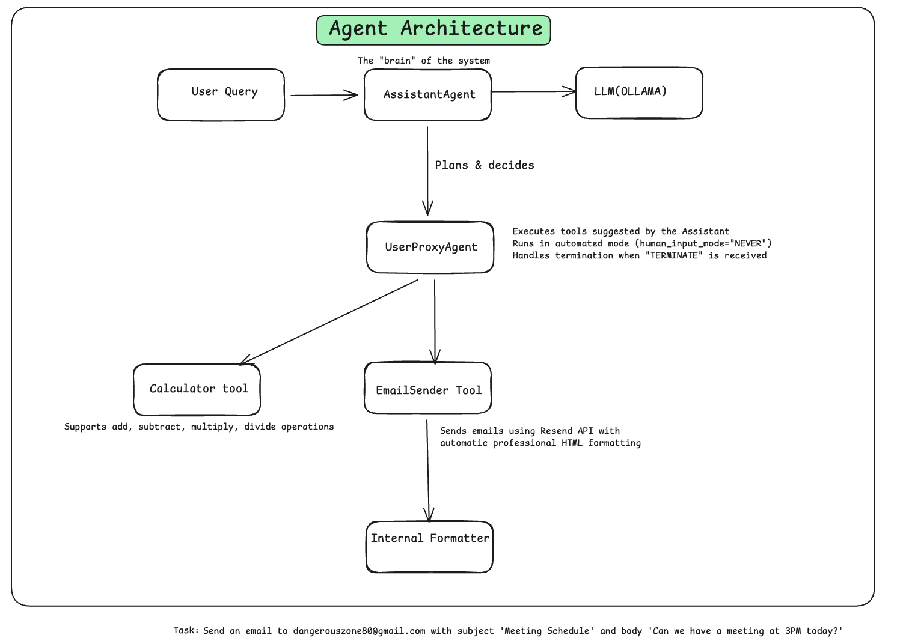

# 📧 Email AI Agent

A Multi-Tool AI Agent built with AutoGen that can perform calculations and send professionally formatted emails. This project demonstrates the ReAct (Reasoning + Acting) pattern where the AI assistant can plan, act using tools, observe results, and respond.

## 📖 Overview

This project extends the basic AI agent concept with multiple tools:
1. **Calculator Tool** - Performs arithmetic operations (add, subtract, multiply, divide)
2. **Send Formatted Email Tool** - Sends emails with automatic professional HTML formatting

The agent uses a two-agent architecture (Assistant + User Proxy) with the email tool handling HTML formatting internally using a temporary LLM agent.

## 🏗️ Architecture

```
┌─────────────────────┐     ┌─────────────────────┐
│   Assistant Agent   │◄───►│   User Proxy Agent  │
│   (Reasoning/LLM)   │     │   (Tool Executor)   │
└─────────────────────┘     └─────────────────────┘
          │                            │
          ▼                            ▼
┌─────────────────────┐     ┌─────────────────────┐
│   Calculator Tool   │     │ Send Formatted      │
│ (add/sub/mul/div)   │     │ Email Tool          │
└─────────────────────┘     └─────────────────────┘
                                      │
                                      ▼
                           ┌─────────────────────┐
                           │ Internal Formatting │
                           │ (Professional HTML) │
                           └─────────────────────┘
```

[](https://www.youtube.com/@myowncampus)


## 🛠️ Prerequisites

- Python 3.14+
- [uv](https://docs.astral.sh/uv/) installed
- [Ollama](https://ollama.com/) running locally (or any OpenAI-compatible API)
- [Resend](https://resend.com/) API key for email functionality

## 📺 Video Tutorial

> Video tutorial coming soon! Subscribe to the channel for updates.

[](https://www.youtube.com/@myowncampus)

## 🚀 How to Run

### 1. Navigate to Project Directory

```bash
cd email-ai-agent
```

### 2. Install Dependencies (from root directory)

If you haven't already installed dependencies:

```bash
# From root directory
uv venv
source .venv/bin/activate
uv sync
```

### 3. Setup Environment Variables

Create a `.env` file in the project directory:

```env
# Ollama Configuration
OLLAMA_MODEL=qwen2.5:7b
OLLAMA_BASE_URL=http://localhost:11434/v1

# Resend Email Configuration
RESEND_API_KEY=your_resend_api_key_here
DEFAULT_SENDER_EMAIL=your-verified-sender@yourdomain.com
```

### 4. Start Ollama (if using locally)

```bash
ollama serve
# In another terminal, pull a model:
ollama pull qwen2.5:7b
```

### 5. Run the Agent

```bash
python app.py
```

Then enter your task when prompted:
```
Enter your task for the AI agent: Send an email to user@example.com with subject 'Hello' and body 'Meeting at 3PM'
```

## 📁 Project Structure

```
email-ai-agent/
├── app.py              # Main application with agent logic
├── config.yaml         # LLM configuration
├── pyproject.toml      # Project dependencies
├── .env               # Environment variables (not in git)
└── README.md          # This file
```

## ⚙️ Configuration

### LLM Configuration (`config.yaml`)

```yaml
config_list:
  - model: "${OLLAMA_MODEL}"
    base_url: "${OLLAMA_BASE_URL}"
    api_key: "ollama"
    price: [0, 0]
    temperature: 0.1
    cache_seed: null
```

### Environment Variables

| Variable | Description | Example |
|----------|-------------|---------|
| `OLLAMA_MODEL` | Ollama model to use | `qwen2.5:7b` |
| `OLLAMA_BASE_URL` | Ollama API endpoint | `http://localhost:11434/v1` |
| `RESEND_API_KEY` | Resend API key | `re_xxxxxxxx` |
| `DEFAULT_SENDER_EMAIL` | Verified sender email | `onboarding@resend.dev` |

## 🧪 Example Tasks

### Calculator Task
```
Enter your task: What is 125 multiplied by 8? Then subtract 50 from the result.
```
**Output:** The agent calculates and returns the result.

### Email Task
```
Enter your task: Send an email to user@example.com with subject 'Meeting Schedule' and body 'Can we have a meeting at 3PM today?'
```
**Output:** The agent sends a professionally formatted HTML email.

## 🔧 How It Works

### Calculator Tool
- Takes two numbers and an operation (add/subtract/multiply/divide)
- Returns the calculated result

### Send Formatted Email Tool
1. Receives plain text subject and body
2. Internally creates a temporary formatter agent
3. Generates professional HTML with:
   - Header section with subject styling
   - Body content with proper typography
   - Footer with professional signature
   - Inline CSS for colors, spacing, and design
4. Sends email via Resend API
5. Returns success message with message ID

**Example HTML Generated:**
```html
<div style="font-family: Arial, sans-serif; max-width: 600px; margin: 0 auto;">
    <div style="background-color: #2c3e50; padding: 20px; text-align: center;">
        <h1 style="color: #ffffff;">Meeting Schedule</h1>
    </div>
    <div style="padding: 30px;">
        <p>Can we have a meeting at 3PM today!!</p>
    </div>
    <div style="background-color: #f8f9fa; padding: 20px;">
        <p>Best regards,<br>Your Name</p>
    </div>
</div>
```

## 📝 Code Structure

### Main Components

1. **Tool Definitions** (lines 30-110)
   - `calculator_tool`: Basic arithmetic operations
   - `send_email_tool`: Basic email sending
   - `format_email_body()`: Internal HTML formatting using temporary agent
   - `send_formatted_email_tool`: Wrapper that formats and sends email

2. **Agent Setup** (lines 113-170)
   - `ollama_assistant`: Main reasoning agent with access to tools
   - `user_proxy`: Executes tools and handles termination

3. **Tool Registration** (lines 173-195)
   - Registers tools with AutoGen for the assistant to use

4. **Main Execution** (lines 198-205)
   - Gets user input
   - Initiates chat between user_proxy and assistant

## 🤝 Contributing

Feel free to:
- 🐛 Report bugs
- 💡 Suggest new features
- 🔧 Submit pull requests
- ⭐ Star the main repo if you find it helpful!

## 📄 License

MIT License - See main repository for details.
